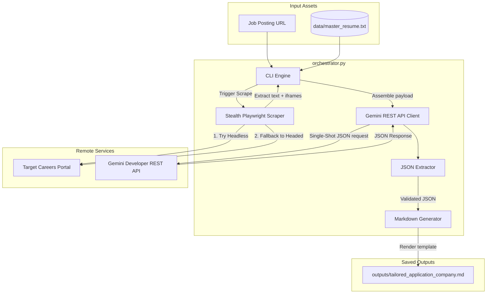

# CareerSync: Automated Application Agent

CareerSync is a local, high-performance Python agent that automates the tedious parts of applying for jobs. Given a job posting URL and a master resume, CareerSync crawls the description, assesses compatibility, identifies missing skill keywords, tailors your professional resume assets, and drafts a targeted cold outreach email—all in a single, token-efficient API transaction.

---

## 🏗️ Architecture & Data Flow

CareerSync is built on a **Single-Shot Architecture** designed to minimize network requests and optimize API token costs. 



---

## 🧠 Key Engineering Feats

### 1. Enterprise Firewall & Anti-Bot Evasion
Standard headless scrapers are instantly blocked by enterprise job boards (like Workday, Taleo, and Cloudflare challenges). CareerSync uses a tiered bypass strategy:
* **Automation Masking**: Spocfs `navigator.webdriver`, `navigator.plugins`, and `navigator.languages` via page initialization scripts and configures realistic viewports and HTTP headers.
* **Auto-Headed Fallback**: If headless browsing gets blocked or receives truncated text, the scraper automatically boots up a **headed browser window** to bypass Cloudflare challenges.
* **Iframe Crawling**: Automatically extracts and compiles text from nested sub-frames, solving the common Workday issue where the description is rendered inside an `iframe`.

### 2. Token-Optimized "Single-Shot" REST Layer
Instead of chaining multiple agent calls (evaluating match -> extracting keywords -> editing resume -> writing email) which consumes excessive tokens and increases latency, CareerSync accomplishes everything in a **single API call**:
* Directly communicates with the native Gemini REST API using `requests` (bypassing heavy SDK wrappers).
* Configures `"responseMimeType": "application/json"` in the API payload to force structured, schema-compliant JSON outputs.
* Employs regex recovery safe-rails to clean up markdown code block wrappers (` ```json `) if returned by the LLM.

---

## 📋 Execution Log Example

Below is a copy of the console execution trace showing the scraper gracefully bypassing a bot blocker using the headed fallback mechanism, analyzing the job description, and writing the final application pack:

```text
============================================================
        AUTOMATED APPLICATION ORCHESTRATOR
============================================================
[INFO] Master resume loaded successfully from 'data/master_resume.txt'.
Enter Job Description URL: https://careers.virtusa.com/job/genai-ml-engineer
Enter Company Name: Virtusa
[INFO] Attempting to scrape job description in headless mode from: https://careers.virtusa.com/job/genai-ml-engineer
[WARNING] Headless scraping failed or was blocked: Headless mode was blocked or returned insufficient page content.
[INFO] Falling back to HEADED mode (visible browser window)...
[INFO] Headed browser launched. Simulating scroll and extracting frame contents...
[INFO] Scraped 4,821 characters of job description text.
[INFO] Running single-shot LLM analysis via Gemini...
[INFO] Tailored application saved successfully to 'outputs/tailored_application_virtusa.md'

============================================================
[SUCCESS] Pipeline completed successfully!
[SUCCESS] Output file: /Users/divyanshgupta/Desktop/CareerSync/outputs/tailored_application_virtusa.md
============================================================
```

---

## 🚀 How to Install & Run

### Prerequisites
Make sure you have **Python 3.10+** installed on your Mac.

### 1. Clone & Set Up Environment
```bash
git clone https://github.com/divyanshgupta1141/CareerSync.git
cd CareerSync

# Create and activate virtual environment
python3 -m venv .venv
source .venv/bin/activate

# Install dependencies
pip install -r requirements.txt
playwright install chromium
```

### 2. Configure Your API Key
Create a `.env` file in the root directory:
```bash
echo 'GEMINI_API_KEY="AIzaSyYourGeminiApiKeyHere"' > .env
```
*Note: `.env` is ignored by git to protect your keys from leaking.*

### 3. Run the Tool
```bash
python3 orchestrator.py
```
You will be prompted for:
1. The Job Description URL.
2. The Company Name.

The formatted outputs will be saved in `outputs/tailored_application_<company_name>.md`.

---

## 🧪 Running Tests

CareerSync comes with standalone test scripts in the `tests/` folder:

* **Scraper Test**: Verifies Playwright launching, user-agent spoofing, and HTML-to-text extraction.
  ```bash
  python3 tests/test_scraper.py
  ```
* **API Parser Test**: Verifies JSON extraction regex and schema alignment.
  ```bash
  python3 tests/test_gemini_api_parsing.py
  ```
